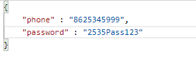

# Lambda-user-API
CRUD api using aws lambda serverless framwork, node, express and MongoDB.

## Features

* Register User with name, phone no and password.
* User login and returns jwt token to access protected routes.
* User update(jwt protected) : A user can update its details.
* Get User Details(jwt protected) : User details can be retrieve using phone no.
* View all Users (jwt protected) : Get all users details excluding password.

## How to install and run?
( prerequisites : `Nodejs` and `serverless` installed in your system. )
1. Clone this project
2. Install all dependencies by `npm install`
3. Config MongoDB by adding your db connect url in `src/config/mongoose.js`
4. Add your ACCESS_TOKEN_SECERT in `.env` (it can be any String used for Encryption and Decryption of JWT token)
5. `serverless offline` or `sls offline`

## How to Deploy?
1. setup `serverless` with your aws credentials.
2. Change region according to your preference in `serverless.yml`
3. `severless deploy` or `sls deploy`

## API endpoints.

1. `/user/create`(POST): Register User with name, phone and password. 
Example input: 
 
Example output: 
 

2. `/user/login`(POST): login User with your phone no and password. 
Example input: 
 
Example output:(Recieve jwt token in response) 
 

> All further requests will include JWT token in Authorization header. 
 

3. `/user/update`(POST): Update User details with name, phone and password. 
Example input: 
 
Example output: 
 

4. `/user/get/:phone`(GET): Get a Particular user details.
Example output: 
 

5. `/user/get/:phone`(GET): Get all user details.
Example output: 
 

## Directory Structure

`src` Contains all source code.
`src/config` Contains config files for js libries used in project. 
`src/middleware` Contains middleware files used in server. 
`src/controllers` Contains functions for controlling the api endpoints. 
`src/models` Contains database models. 
`src/routes` Contains all routes.
